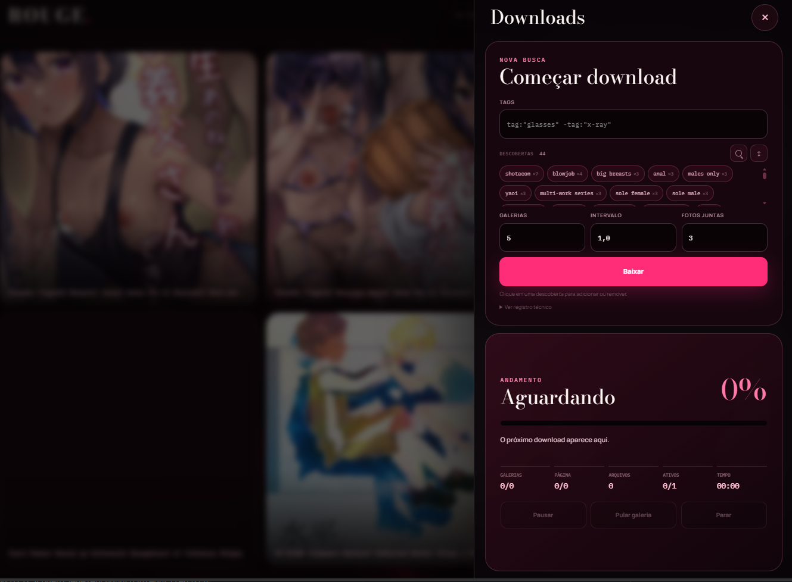

# Rouge Downloader

Aplicativo local para pesquisar e baixar galerias, acompanhar imagens em tempo real e organizar uma coleção privada no próprio computador.

> Projeto destinado exclusivamente a maiores de 18 anos. Nenhuma galeria ou imagem de terceiros está incluída no repositório ou nas Releases. Use somente de acordo com as leis aplicáveis e os termos do serviço acessado.

## Interface

### Downloads sem sair da coleção

O painel lateral reúne uma nova busca, as tags descobertas e todo o andamento do download em um único lugar.



### Sua coleção no computador

Explore as galerias salvas e filtre instantaneamente por título, código ou tag.


## Versão portátil v1.1.0

Baixe `Rouge-Windows-x64-v1.1.0.zip` na [Release mais recente](https://github.com/joaovfnandes/rouge-downloader/releases/latest), extraia a pasta inteira e abra `Rouge.exe`.

Não é necessário instalar Python. Consulte [GUIA_PORTATIL.md](GUIA_PORTATIL.md) para instalação, atualização e solução de problemas.

## Recursos

- Downloads paralelos configuráveis.
- Pausar, continuar, parar e pular a galeria atual.
- Imagens aparecem conforme terminam de baixar.
- Proteção contra galerias duplicadas.
- Histórico e filtro das tags descobertas.
- Filtro da coleção por título, código ou tag.
- Layouts Editorial, Mosaico e Foco.
- Coleção e leitor locais.
- Interface responsiva.

## Privacidade

Tudo é armazenado localmente em `nhentai_out/`, `tag_history.json` e `logs/`. Esses dados são ignorados pelo Git e não fazem parte da versão pública.

## Executar pelo código-fonte

Requer Python 3.12 ou mais recente.

```powershell
python -m venv .venv
.venv\Scripts\python -m pip install -r requirements.txt
.venv\Scripts\python app.py
```

No Windows, também é possível abrir `rodar.bat`.

## Criar a pasta portátil

Abra `build_portable.bat`. O resultado será criado em `dist\Rouge`.

## Aviso

Este projeto não é afiliado, patrocinado ou aprovado pelo nhentai. O usuário é responsável pelo conteúdo que decide acessar e armazenar.
